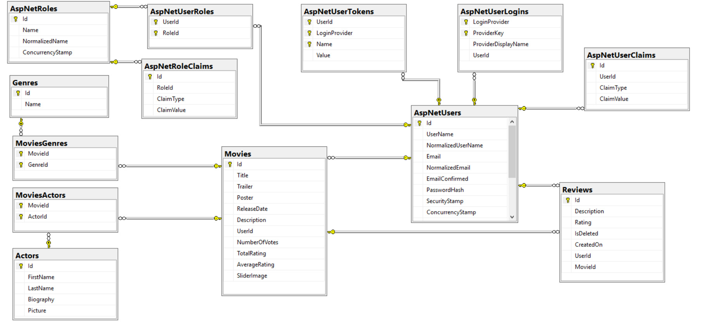

## Movies Catalog - ASP.NET Core MVC 2.2

----

### Made by Team: Alpha Pro

- Stanil Dimitrov
- Peter Penev

#### Team leader
- Stanil Dimitrov

### Project Purpose
We are aiming to create a movie catalog with rating system accessed from web.

### Features 
- <b>Registration Part</b> 
   Users can register as user of web application.

- <b>Administration Part</b> 
   Administrators can:

1.  use complete functionality of web application
2.  create movies, actors, genres
3.  update and edit movies and actors
4.  add genre to movie
5.  add actor to movie
6.  promote other users to be administrators

- <b>Public part visible without authentication</b> 
   You can:

1.  search for movies, actors and other users
2.  read reviews and browse to genres

- <b>Private part visible without authentication</b> 
   User can:

1.  add review  
    
- <b>Rating and Review system</b>

    Users can rate and review every movie. Checking a movie will display the total rating and the top number of reviews.
    A rating can be added without review. User can update or delete his review  and  delete his user's profile.

### Database Diagrama

- DbDiagram20190511.png 

    
### Repository [repo]
### Azure [azure]

[repo]: https://gitlab.com/stanildimitrov/movies-catalog---asp.net.mvc
[azure]: https://dev.azure.com/stanildimitrov/Online%20Movies%20Catalog/_boards/board/t/Online%20Movies%20Catalog%20Team/Issues

